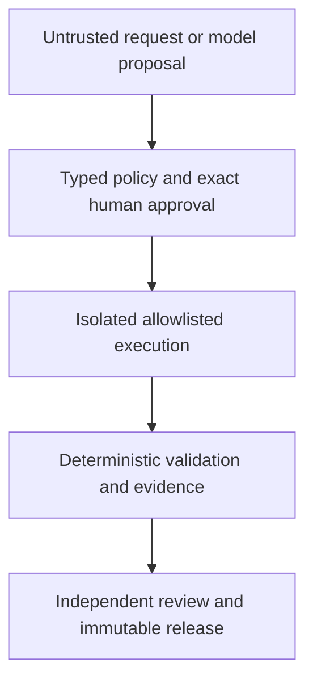

# ActionCharter

[](https://github.com/wanggiya/action-charter/actions/workflows/test.yaml)
[](https://github.com/wanggiya/action-charter/actions/workflows/container-build.yaml)
[](LICENSE)
[](pyproject.toml)

**A governed execution harness for AI agents using professional tools.**

ActionCharter turns uncertain model proposals into explicitly scoped,
human-approved and independently verifiable work. Models may interpret a
request and propose actions; deterministic software controls what can execute,
which evidence is authoritative and whether a result may be released.

The current reference implementation applies this architecture to geospatial
data with GeoPandas, GDAL, rasterio, PostGIS and GeoServer-oriented workflows.
The control plane is designed to support additional professional-tool domains
without granting models broad shell, credential, database or filesystem
authority.

> ActionCharter is an alpha research and pilot implementation. It is not yet a
> hardened multi-user production control plane.

## Why ActionCharter?

Giving a model access to a powerful tool is easy. Establishing that the model
used the right input, stayed within scope, received exact approval, produced a
valid result and left independently verifiable evidence is the harder problem.

An **action charter** binds together:

- the requested objective and selected trusted operation;
- validated arguments and contained paths;
- the exact plan or recipe digest;
- explicit human approval for consequential steps;
- isolated execution through allowlisted adapters;
- deterministic post-action validation;
- redacted operational history and immutable evidence;
- release eligibility based on completeness, not model confidence.

Generated text cannot grant permissions, select arbitrary trusted entrypoints
or become trusted implementation automatically.

## Control flow



The Planner and Critic may share a local model runtime, but they receive
different manifests, context and permissions. The Executor does not receive
model access. Professional tools and credentials remain behind the internal
MCP boundary.

## Implemented capabilities

| Boundary | Current implementation |
|---|---|
| Planning | Bounded task context, schema-constrained plans and deterministic policy |
| Authorization | Append-only approval records bound to exact SHA-256 identities and step scope |
| Execution | Typed envelopes and fixed approval-gated MCP operations |
| Data quality | Versioned vector contracts and deterministic dirty-data benchmarks |
| Validation | Independent vector, raster and PostGIS checks; models cannot declare success |
| Evidence | Redacted traces, reports, lineage and digest-addressed records |
| Operational history | Typed append-only events with stable run, task and correlation identities |
| Critic | Separate read-only assessment that cannot alter authoritative status |
| Release | Immutable six-component workflow packages with independent inspection |
| Reproducibility | Approval-gated Snakemake export, static validation, dry-run and replay |
| Generated extensions | Isolated Builder candidates, offline tests, review, promotion and post-activation verification |

The geospatial reference domain currently includes vector inspection and
conversion, raster inspection and controlled conversion, PostGIS loading and
validation, declarative recipes, and a restricted skill registry.

Bounded PostGIS metadata inspection is available without accepting SQL:

```bash
geoagent inspect-postgis-table \
  --schema agent_sandbox \
  --table sample_points \
  --pretty
```

The command uses the configured read-only database boundary and reports
bounded relation, column, key, geometry, CRS, count and extent facts. The
schema must be allowlisted and both identifiers must pass the conservative
identifier policy.

Compare two exact tables through the same boundary:

```bash
geoagent compare-postgis-tables \
  --reference-schema agent_sandbox \
  --reference-table current_layer \
  --candidate-schema agent_sandbox \
  --candidate-table candidate_layer \
  --pretty
```

The command returns exit code zero for matching facts, one for typed
differences, and two when safe comparison evidence is unavailable.

Classify those facts with the fixed change policy:

```bash
geoagent assess-postgis-change \
  --reference-schema agent_sandbox \
  --reference-table current_layer \
  --candidate-schema agent_sandbox \
  --candidate-table candidate_layer \
  --pretty
```

The result is `compatible`, `review_required`, or `incompatible`. Assessment
is read-only and cannot approve or authorize promotion.

## Pilot demonstration

Checkpoint 14F provides a fixed, repeatable scenario that connects the major
boundaries. Its first gate is read-only and deterministic:

```bash
make checkpoint14f-readiness
```

The command verifies a clean vector control, an invalid-geometry case, the
contract identity and the exact workflow input digest. It does not call a
model, create approval, execute a workflow, modify data or create a release.

The complete walkthrough continues through proposal, compilation, exact human
approval, PostGIS execution, validation, operational history, separate Critic
evidence, authoritative release inspection and approved Snakemake replay. See
[the Checkpoint 14F demonstration](demonstrations/checkpoint14f/README.md).

## Quick start

### Requirements

- Linux or WSL2;
- Python 3.11 or newer;
- Docker Engine with Compose v2;
- optional local Ollama-compatible endpoint for Planner, Builder and Critic;
- optional externally managed PostGIS for database workflows.

The offline unit tests and read-only fixture checks do not require model or
database credentials.

### Install

```bash
git clone https://github.com/wanggiya/action-charter.git
cd action-charter
make install
```

Run the complete offline suite:

```bash
make test
```

Run two read-only checks:

```bash
make inspect
make checkpoint14f-readiness
```

Validate and build the container topology:

```bash
make config
make build
```

Copy `.env.example` to `.env` only when configuring local services. Never
commit `.env`, credentials, private datasets or generated operational
evidence.

## Local model configuration

ActionCharter uses an OpenAI-compatible chat-completions interface and is
developed against a shared local Ollama runtime. Relevant non-secret settings
include:

```dotenv
MODEL_PROVIDER=ollama
MODEL_BASE_URL=http://host.docker.internal:11434/v1
MODEL_NAME=qwen3:8b
MODEL_TIMEOUT_SECONDS=120
```

The model is used for constrained interpretation and assessment. It does not
receive PostGIS credentials or determine deterministic success.

## Security model

Core invariants include:

- model output is always untrusted input;
- the safe default is `ENABLE_WRITE_TOOLS=false`;
- there is no unrestricted shell or unrestricted SQL tool;
- approvals bind exact plan or recipe identities and explicit write steps;
- trusted inputs and registries are read-only at execution boundaries;
- paths must remain beneath approved roots and symlinks fail closed;
- credentials are excluded from prompts, results, traces and reports;
- generated code is tested in an isolated networkless candidate workspace;
- deterministic verification is the only success gate;
- incomplete evidence withholds authoritative release status.

Read [SECURITY.md](SECURITY.md) and
[runtime boundaries](context/RUNTIME_BOUNDARIES.md) before deploying or
extending an execution path.

## Repository guide

| Path | Purpose |
|---|---|
| `src/geoagent_harness/` | Core policies, agents, adapters, evidence and release code |
| `agents/` | Trusted role manifests and bounded instructions |
| `context/` | Architecture, status, decisions, catalogs and trusted context |
| `skill-definitions/` | Declarative trusted skill definitions |
| `skills/` | Installed GIS skill contracts and documentation |
| `benchmarks/` | Deterministic spatial-contract fixtures and expectations |
| `demonstrations/` | Repeatable operator walkthroughs |
| `docker/` and `compose.yaml` | Isolated runtime boundaries |
| `tests/` | Offline policy, schema, security and workflow tests |

Detailed project records:

- [architecture](context/ARCHITECTURE.md);
- [current implementation status](context/CURRENT_STATUS.md);
- [product roadmap](context/PRODUCT_ROADMAP.md);
- [accepted architectural decisions](context/DECISIONS.jsonl);
- [dataset catalog](context/DATASET_CATALOG.json);
- [skills index](context/SKILLS_INDEX.yaml);
- [changelog](CHANGELOG.md).

## Current scope

The presentation-focused vector pilot and its supporting Checkpoints 1–14F are
implemented. Current work remains prototype-level. Important future work
includes expanded PostGIS lifecycle operations, restricted GeoServer
publication, a guided interface, production authentication, multi-user
authorization, strict network egress enforcement and broader non-GIS domain
adapters.

The project deliberately does not compete by exposing the largest possible
tool catalog. Its focus is the controlled path from uncertain intent to
validated, inspectable and reproducible action.

## Compatibility

The public project and Python distribution are named ActionCharter. The
initial `0.9.x` releases retain the `geoagent_harness` Python package and the
`geoagent` and `geoagent-mcp` commands. Existing evidence fields, Compose
service names and established internal `GeoAgent*` types also remain
compatibility interfaces.

A future namespace migration requires a separately reviewed compatibility
plan; it is not part of the public-project rename.

## Contributing

Contributions are welcome when they preserve ActionCharter's trust boundaries.
Read [CONTRIBUTING.md](CONTRIBUTING.md) before opening a pull request. Report
vulnerabilities through the private process in [SECURITY.md](SECURITY.md), not
through a public issue.

## Citation and license

ActionCharter was created by **Jay Qi**. Citation metadata is available in
[CITATION.cff](CITATION.cff).

Copyright 2026 Jay Qi. Licensed under the Apache License, Version 2.0. See
[LICENSE](LICENSE) and [NOTICE](NOTICE).
