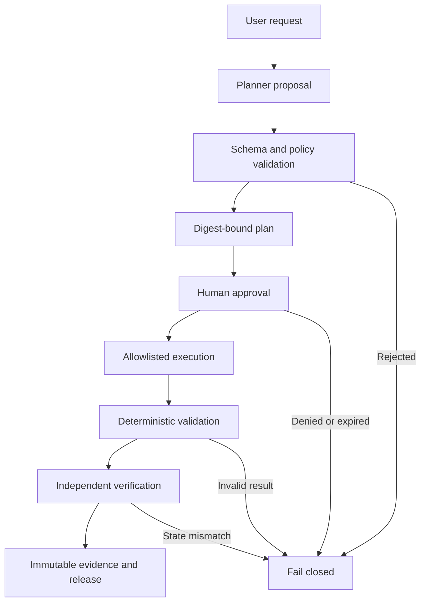
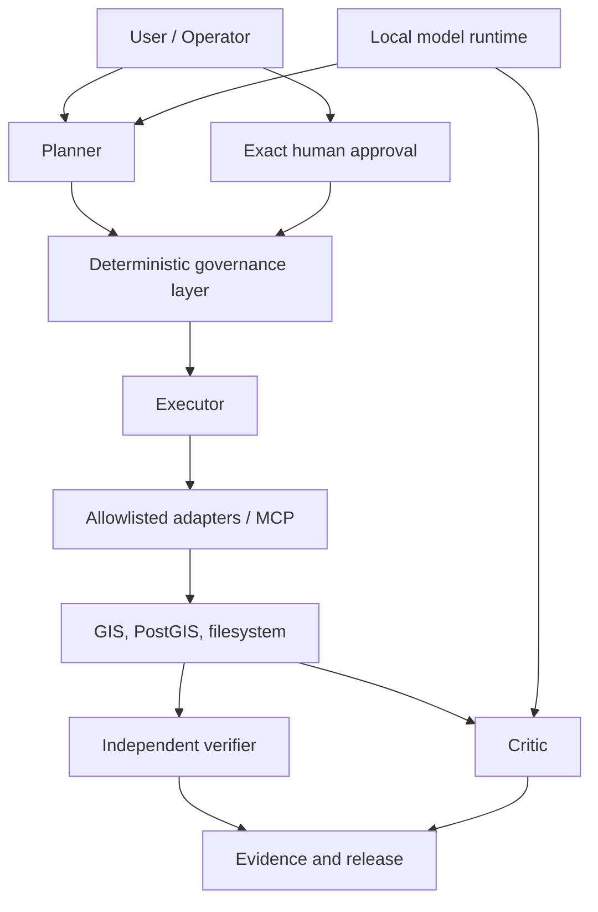
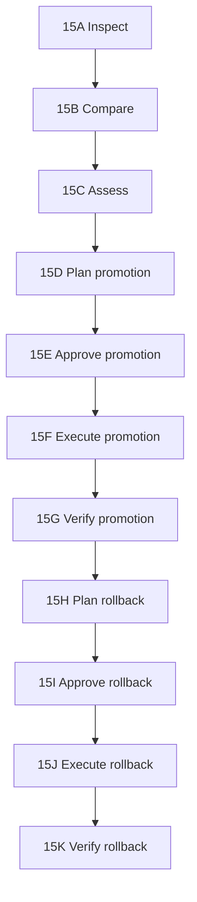

# ActionCharter

[](https://github.com/wanggiya/action-charter/actions/workflows/test.yaml)
[](https://github.com/wanggiya/action-charter/actions/workflows/container-build.yaml)
[](LICENSE)
[](pyproject.toml)
[](https://codespaces.new/wanggiya/action-charter?quickstart=1)

**A governed execution harness for AI agents using professional tools.**

ActionCharter lets models interpret requests and propose work without giving
them unrestricted authority over shells, databases, filesystems, credentials,
or production systems. Deterministic software validates the proposal, binds
approval to its exact scope, dispatches only allowlisted operations, verifies
the resulting state, and preserves tamper-evident evidence.

> **Models propose; deterministic software authorizes, executes, validates,
> and records evidence.**

The current reference implementation applies this architecture to geospatial
data with GeoPandas, GDAL, rasterio, PostGIS, and GeoServer-oriented workflows.
GIS is the first reference domain, not the architectural limit.

> ActionCharter is an alpha research and pilot implementation. It is not yet a
> hardened multi-user production control plane.

## Why ActionCharter?

Giving a model access to a powerful tool is easy. The harder problem is proving
that an AI-assisted operation:

1. used the correct input;
2. selected an allowed operation;
3. remained inside an explicitly bounded scope;
4. received approval for the exact consequential steps;
5. executed only what was approved;
6. produced a valid result;
7. was independently verified; and
8. left evidence that can be inspected later.

Generated text never becomes authority merely because a model generated it.
ActionCharter turns an uncertain proposal into a chain of typed, digest-bound,
and independently checkable artifacts.

## Governed execution flow



For consequential mutations, rollback is another governed operation. It
requires its own deterministic plan, exact approval, transactional execution,
and independent verification; it is not an emergency bypass.

## Agents and authority

Planner, Executor, and Critic are intentionally separated. The Planner and
Critic may use the same local model runtime, but they receive different
contexts and permissions. The Executor has no model authority. Professional
tools and credentials remain behind controlled adapters and the internal MCP
boundary.



| Component | May do | May not do |
|---|---|---|
| Planner | Interpret a bounded request and propose a typed plan | Execute tools or approve work |
| Executor | Run an already-authorized typed operation | Use a model or invent operations |
| Critic | Assess bounded evidence and identify unresolved risks | Change authoritative workflow state |
| Governance layer | Enforce schemas, policy, digests, scope, and approval | Treat generated text as permission |
| Human operator | Approve or deny an exact consequential scope | Implicitly approve a changed plan |
| Verifier | Reload authoritative artifacts and inspect resulting state | Trust an executor's success claim |

The Builder explores generated extensions under a separate lifecycle:
candidate generation, bounded materialization, offline tests, review,
digest-bound promotion, activation, and post-activation verification. Generated
code remains untrusted until those deterministic controls succeed.

## Skills, recipes, and workflows

These terms describe different layers and should not be used interchangeably:

| Concept | Meaning | Example |
|---|---|---|
| Skill | One bounded capability with a typed contract and policy boundary | `inspect_raster` |
| Recipe | A reusable, parameterized definition that connects trusted skills | Inspect a raster, convert it, then validate the result |
| Workflow | One proposed, approved, running, or completed instance with specific inputs, state, timing, and evidence | Convert `dem.tif` to EPSG:3857 in a particular run |

A recipe may contain several skill steps. A workflow may be created from a
recipe, but it becomes a distinct run with its own plan, approval requirements,
results, validation, and evidence. Interface templates select trusted recipes;
they do not install skills or represent completed workflows. See
[Core concepts and equivalence testing](docs/CORE_CONCEPTS.md).

The first versioned CLI/interface parity scenario is documented in
[Checkpoint 17L](docs/CHECKPOINT17L.md). It compiles one trusted vector
conversion proposal without saving, approving or executing it, establishing
the baseline for the next typed interface-service slice.

[Checkpoint 17M](docs/CHECKPOINT17M.md) adds the first live interface backend:
a loopback-only typed service for loading the trusted template catalog and
compiling an exact proposal in memory. Start it alongside Vite:

```bash
# terminal 1
.venv/bin/geoagent serve-interface-api --project-root .

# terminal 2
corepack pnpm@10.17.1 --dir interface dev
```

The interface can now preview, download and compile a trusted-template
proposal. It still cannot save, approve or execute one.

[Checkpoint 17N](docs/CHECKPOINT17N.md) adds a separate reviewed-save action.
The interface displays the complete compiled step order and recipe SHA-256,
requires explicit operator confirmation, then recompiles and verifies that
digest before immutable storage under `workflow-recipes/`. Saving still grants
no approval or execution authority.

[Checkpoint 17O](docs/CHECKPOINT17O.md) adds a read-only inventory of immutable
stored recipes. The successful save card now provides **Done — view saved
recipes**, and the top bar provides a persistent **Recipes** control. Inventory
cards show exact digests, ordered skills and future approval/validation gates
without exposing arguments or granting approval or execution authority.

[Checkpoint 17P](docs/CHECKPOINT17P.md) lets an operator prepare an exact
approval request for one stored recipe. It revalidates the canonical recipe and
policy, binds every required step to the recipe digest, and displays a separate
approval-request digest. Preparation records no decision and cannot execute.

[Checkpoint 17Q](docs/CHECKPOINT17Q.md) adds a separate append-only human
approve/deny action. The backend reprepares the request, verifies both digests,
derives the step scope server-side, redacts operator text, and stores approval
evidence beneath `approvals/`. Recording a decision still cannot execute.
The interface then independently reloads and verifies the exact recipe and approval
against current policy. Large authority cards distinguish append-only evidence,
verified approval scope, and the separate fact that nothing has executed. See
`docs/CHECKPOINT17R.md`.
After verification, the interface can build and inspect the exact governed
execution envelope—including ordered skills, redacted arguments, declared outputs,
validation requirements and evidence roots—without running it. See
`docs/CHECKPOINT17S.md`.
Checkpoint 17T adds the first interface execution action for that exact preview.
It remains disabled by default, requires explicit write-tool startup authority and
operator confirmation, revalidates every artifact server-side, dispatches only
registered recipe skills, and records run, evidence and report artifacts. See
`docs/CHECKPOINT17T.md`.

## Complete PostGIS reference lifecycle

Checkpoints 15A–15K provide the strongest end-to-end demonstration of the
governance model:



The inspection, comparison, and assessment stages are read-only and accept no
arbitrary SQL. Promotion and rollback execute only fixed, approved relation
renames inside serializable transactions. Separate verifiers reload the exact
plan, approval, and execution evidence and inspect PostGIS through independent
read-only transactions.

Representative commands:

```bash
geoagent inspect-postgis-table --schema agent_sandbox --table sample_points --pretty

geoagent compare-postgis-tables \
  --reference-schema agent_sandbox --reference-table current_layer \
  --candidate-schema agent_sandbox --candidate-table candidate_layer --pretty

geoagent assess-postgis-change \
  --reference-schema agent_sandbox --reference-table current_layer \
  --candidate-schema agent_sandbox --candidate-table candidate_layer --pretty
```

The remaining lifecycle is exposed through `plan-postgis-promotion`,
`record-postgis-promotion-approval`, `execute-postgis-promotion`,
`verify-postgis-promotion`, `plan-postgis-rollback`,
`record-postgis-rollback-approval`, `execute-postgis-rollback`, and
`verify-postgis-rollback`.

Checkpoint 16A adds bounded, read-only inspection of one exact allowlisted
GeoServer workspace, datastore, and layer without accepting arbitrary REST
paths or modification methods:

```bash
geoagent inspect-geoserver-layer \
  --workspace geoagent_test \
  --datastore actioncharter_postgis \
  --layer checkpoint3e_sample_points \
  --pretty
```

See the [Checkpoint 16A local setup](docs/CHECKPOINT16A.md) for allowlists and
password-file configuration, including the dedicated GeoServer test user,
workspace-scoped REST role, PostGIS-backed datastore, and Docker network.

Checkpoint 16B adds the first governed GeoServer mutation. It can only enable
and advertise an existing allowlisted feature type and its published layer
after the current state has been captured in an exact SHA-256 plan and a human
approval binds that digest. The executor revalidates the state before one fixed
PUT to the authoritative feature-type resource, validates the complete effective
result, and compensates to the pre-state if the
transition fails. A separate command independently reinspects the layer.
See [Checkpoint 16B](docs/CHECKPOINT16B.md).

## Implemented capabilities

| Boundary | Current implementation |
|---|---|
| Planning | Bounded task context, schema-constrained plans, and deterministic policy |
| Authorization | Append-only approvals bound to exact SHA-256 identities and step scope |
| Execution | Typed envelopes and fixed approval-gated MCP operations |
| Data quality | Versioned vector contracts and deterministic dirty-data benchmarks |
| GIS operations | Controlled vector and raster inspection/conversion and PostGIS loading |
| PostGIS lifecycle | Bounded inspection through independently verified promotion and rollback |
| Evidence | Redacted traces, reports, lineage, and digest-addressed records |
| Operational history | Typed events with stable run, task, and correlation identities |
| Critic | Separate read-only assessment that cannot alter authoritative status |
| Release | Immutable workflow packages with independent inspection |
| Reproducibility | Approval-gated Snakemake export, validation, dry-run, and replay |
| Generated extensions | Isolated Builder candidates, offline tests, promotion, and activation verification |

## Pilot demonstration

Checkpoint 14F connects proposal, deterministic compilation, human approval,
PostGIS execution, validation, operational history, Critic evidence,
authoritative release inspection, and Snakemake replay.

Its first gate is read-only and deterministic:

```bash
make checkpoint14f-readiness
```

It verifies a clean vector control, an invalid-geometry case, the contract
identity, and the exact workflow-input digest. It does not call a model, create
approval, execute a workflow, modify data, or create a release. See the
[Checkpoint 14F demonstration](demonstrations/checkpoint14f/README.md) for the
complete walkthrough.

## Quick start

### Requirements

- Linux or WSL2;
- Python 3.11 or newer;
- Docker Engine with Compose v2 for containerized boundaries;
- optional local Ollama-compatible endpoint for Planner, Builder, and Critic;
- optional externally managed PostGIS for database workflows.

The primary development environment is **Ubuntu 24.04 LTS under WSL2**. Hosted
CI exercises the offline suite and container contracts on Ubuntu. Other modern
Linux environments are expected to work but are not tested to the same level.

Offline unit tests and read-only fixture checks do not require model or
database credentials.

### Install and test

```bash
git clone https://github.com/wanggiya/action-charter.git
cd action-charter
make install
make test
```

Run two read-only checks:

```bash
make inspect
make checkpoint14f-readiness
```

Validate and build the container topology:

```bash
make config
make build
```

Copy `.env.example` to `.env` only when configuring local services. Never
commit `.env`, credentials, private datasets, or generated operational
evidence.

### Remote development

The repository includes a GitHub Codespaces development-container
configuration for remote Linux development from a browser, including an
Android phone. Codespaces is the recommended execution environment; native
Termux is limited to editing, Git, and use as an SSH client because it does not
reproduce the project's complete Linux, GIS, Docker Compose, and PostGIS
boundaries.

See [remote development from Android](docs/REMOTE_DEVELOPMENT.md) for setup,
validation, cost-control, security, and recovery guidance.

## Local model configuration

ActionCharter uses an OpenAI-compatible chat-completions interface and is
developed against a shared local Ollama runtime:

```dotenv
MODEL_PROVIDER=ollama
MODEL_BASE_URL=http://host.docker.internal:11434/v1
MODEL_NAME=qwen3:8b
MODEL_TIMEOUT_SECONDS=120
```

The model is used for constrained interpretation and assessment. It does not
receive PostGIS credentials or determine deterministic success.

## Security model

Core invariants include:

- model output is always untrusted input;
- `ENABLE_WRITE_TOOLS=false` is the safe default;
- no interface accepts unrestricted shell commands or arbitrary SQL;
- approvals bind exact artifact identities and explicit consequential steps;
- trusted inputs and registries remain read-only at execution boundaries;
- approved paths must remain under bounded roots and symlinks fail closed;
- credentials are excluded from prompts, results, traces, and reports;
- generated code is tested inside an isolated, network-disabled workspace;
- independent deterministic verification—not model confidence—is the success gate;
- incomplete or inconsistent evidence withholds authoritative status.

Read [SECURITY.md](SECURITY.md) and the
[runtime boundaries](context/RUNTIME_BOUNDARIES.md) before deploying or
extending an execution path.

## Repository guide

| Path | Purpose |
|---|---|
| `src/geoagent_harness/` | Core policies, agents, adapters, workflows, evidence, and release code |
| `agents/` | Trusted role manifests and bounded instructions |
| `context/` | Architecture, status, decisions, catalogs, and trusted context |
| `skill-definitions/` | Declarative trusted skill definitions |
| `skills/` | Installed GIS skill contracts and documentation |
| `benchmarks/` | Deterministic spatial-contract fixtures and expectations |
| `demonstrations/` | Repeatable operator walkthroughs |
| `docs/` | Operator and development guides |
| `.devcontainer/` | Reproducible Codespaces and Dev Container configuration |
| `docker/` and `compose.yaml` | Isolated runtime boundaries |
| `tests/` | Offline policy, schema, security, and workflow tests |

Detailed project records:

- [architecture](context/ARCHITECTURE.md);
- [current implementation status](context/CURRENT_STATUS.md);
- [project summary](context/PROJECT_SUMMARY.md);
- [product roadmap](context/PRODUCT_ROADMAP.md);
- [accepted architectural decisions](context/DECISIONS.jsonl);
- [dataset catalog](context/DATASET_CATALOG.json);
- [skills index](context/SKILLS_INDEX.yaml);
- [changelog](CHANGELOG.md).

## Current scope and non-goals

ActionCharter demonstrates a complete governed PostGIS mutation and rollback
lifecycle, but remains a single-operator alpha rather than a production control
plane. Production authentication, multi-user authorization, strict network
egress enforcement, broader domain adapters, and a guided interface remain
future work.

The project deliberately does not compete by exposing the largest possible
tool catalog. Its focus is the controlled path from uncertain intent to
validated, inspectable, reversible, and reproducible action.

## Compatibility

The public project and Python distribution are named ActionCharter. The
initial `0.9.x` releases retain the `geoagent_harness` Python package and the
`geoagent` and `geoagent-mcp` commands. Existing evidence fields, Compose
service names, and established internal `GeoAgent*` types also remain
compatibility interfaces.

A future namespace migration requires a separately reviewed compatibility
plan; it is not part of the public-project rename.

## Read-only workflow interface

Checkpoint 17A introduces a polished blueprint-style workflow explorer under
[`interface/`](interface/). It visualizes the complete governed path as
connected nodes and exposes node authority, evidence references and execution
status in a read-only inspector. It uses React, TypeScript, Vite, Zod and plain
CSS; the browser cannot approve or execute work.

```bash
cd interface
pnpm install --frozen-lockfile
pnpm dev
```

See [Checkpoint 17A](docs/CHECKPOINT17A.md) for the frontend trust boundary and
the planned progression from visualization to proposal-only graph editing.
Future pandas and external-service capabilities are recorded in the
[capability expansion backlog](context/CAPABILITY_EXPANSION.md).
If `pnpm` starts Windows `CMD.EXE` from WSL, follow the
[WSL frontend setup](docs/WSL_FRONTEND_SETUP.md) before installing packages.

To inspect a real validated workflow without granting browser filesystem
access, generate the bounded local projection described in
[Checkpoint 17B](docs/CHECKPOINT17B.md). Invalid or absent runtime projections
fall back to the sanitized demonstration graph.

Checkpoint 17C adds a bounded run inventory and read-only header selector. See
[Checkpoint 17C](docs/CHECKPOINT17C.md) to export all validated local traces in
one command without remembering individual task IDs.

Checkpoint 17D makes each projected node inspectable. Selecting a node shows a
bounded summary, aggregate observed facts, timing and safe findings derived
from the validated trace—never the original request, tool payloads, secrets or
private paths. See [Checkpoint 17D](docs/CHECKPOINT17D.md).

Checkpoint 17E adds expandable evidence cards to relevant nodes. These display
the important verified metadata—category, state, safe reference, digest and
bounded facts—without turning the browser into a raw trace or filesystem
viewer. See [Checkpoint 17E](docs/CHECKPOINT17E.md).

Checkpoint 17F replaces the fixed tool placeholder with actual recorded
operation nodes and dynamically sizes both graph orientations. See
[Checkpoint 17F](docs/CHECKPOINT17F.md) and the complete
[interface product scope](docs/INTERFACE_PRODUCT_SCOPE.md).

Checkpoint 17G establishes the semantic visual system: process category and
performer are independent, related work appears in ownership frames, and graph,
minimap and inspector share a restrained professional palette. See
[Checkpoint 17G](docs/CHECKPOINT17G.md).

Checkpoint 17H separates agent/control interaction from tool/data flow using a
typed edge contract and distinct graph lanes. User Request and referenced
Input Data enter the Planner separately; hollow triangular sockets identify
agent interaction, circular sockets identify data/tool relationships, and
Executor connects only to the first recorded operation. Operations then follow
trace order and only the final operation connects to validation.
Sockets use left/right sides horizontally and top/bottom sides vertically.
After updating the projection contract, re-export ignored runtime JSON files;
catalog-selected runs now report stale or invalid projections instead of
silently displaying the same demonstration graph. See
[Checkpoint 17H](docs/CHECKPOINT17H.md).

The projection includes only components supported by each trace. Snakemake is
visible when its runtime or operation is explicitly recorded; older replay
evidence without engine metadata cannot be inferred from a task name.

Checkpoint 17I adds a separate proposal-editing foundation. Evidence view
remains immutable, while Proposal edit creates a browser-local draft whose
nodes can be added, renamed, deleted and repositioned. The draft cannot approve
or execute work and is discarded on exit. See
[Checkpoint 17I](docs/CHECKPOINT17I.md).

Checkpoint 17J makes the proposal topology editable. From the selected block,
an operator can create a compatible typed connection, inspect its direction,
or delete it. A connection can also be drawn directly by holding an output
socket, dragging the live wire and releasing it on a compatible empty input.
Duplicate, incompatible, occupied, self-referential and cyclic connections are
rejected locally. Filled sockets are connected and hollow sockets remain
available. Performer assignment uses bounded project roles. The proposal is
still browser-local and cannot execute or persist.
See [Checkpoint 17J](docs/CHECKPOINT17J.md).

Checkpoint 17K connects the interface to the repository's existing trusted
recipe templates. Export `context/RECIPE_TEMPLATES.yaml` through the existing
`recipe-template-catalog` CLI command, then select a template and fill its
required parameters in the Inspector. The interface renders its declared step
graph and can download a validated, non-executable proposal accepted by the
existing proposal compiler. See [Checkpoint 17K](docs/CHECKPOINT17K.md).

The completed interface is intended to operate the full governed lifecycle
without requiring routine command-line use. The CLI remains supported for
automation, CI, debugging and expert workflows; both surfaces will use the same
backend contracts and authority boundaries.

## Contributing

Contributions are welcome when they preserve ActionCharter's trust boundaries.
Read [CONTRIBUTING.md](CONTRIBUTING.md) before opening a pull request. Report
vulnerabilities through the private process in [SECURITY.md](SECURITY.md), not
through a public issue.

## Citation and license

ActionCharter was created by **Jay Qi**. Citation metadata is available in
[CITATION.cff](CITATION.cff).

Copyright 2026 Jay Qi. Licensed under the Apache License, Version 2.0. See
[LICENSE](LICENSE) and [NOTICE](NOTICE).
