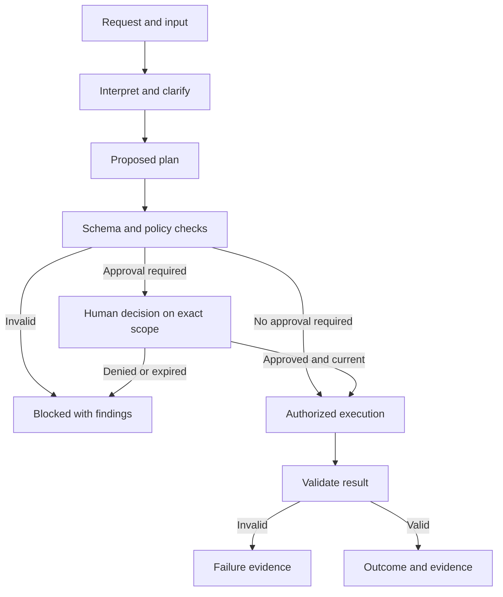
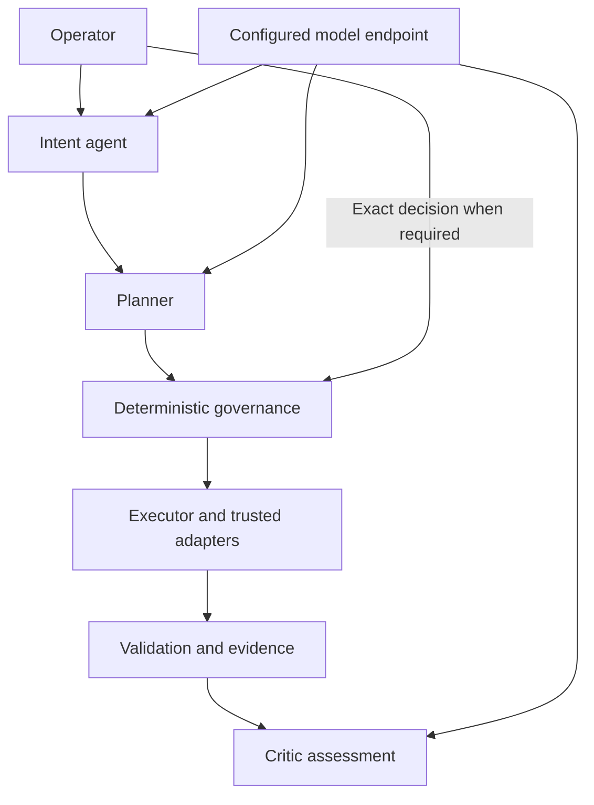

# ActionCharter

[](https://github.com/wanggiya/action-charter/actions/workflows/test.yaml)
[](https://github.com/wanggiya/action-charter/actions/workflows/container-build.yaml)
[](LICENSE)
[](pyproject.toml)
[](https://codespaces.new/wanggiya/action-charter?quickstart=1)

**Local AI-assisted data workflows with explicit approval and verifiable results.**

Describe a task, inspect the proposed steps, and run supported operations through a governed backend. Models help interpret requests and assess evidence; deterministic software checks scope, permissions and results. The interface and CLI use the same backend contracts.

The current reference domain is geospatial data: vector and raster inspection/conversion, PostGIS workflows and bounded GeoServer inspection/publication. Local Ollama is supported through an OpenAI-compatible model endpoint.

**Status: single-operator alpha.** Existing recipe workflows can execute through the interface. Planner agent now offers exact-scope execution for supported inspection and recipe workflows. The separate Context & intent journey still has integration limits. This is not yet a packaged desktop app or a hardened multi-user service.

## Why ActionCharter?

Giving a model access to a powerful tool is easy. The harder problem is proving
that an AI-assisted operation:

1. used the correct input;
2. selected an allowed operation;
3. remained inside an explicitly bounded scope;
4. received approval for the exact consequential steps;
5. executed only what was approved;
6. produced a valid result;
7. was independently verified; and
8. left evidence that can be inspected later.

Generated text never becomes authority merely because a model generated it.
ActionCharter turns an uncertain proposal into a chain of typed, digest-bound,
and independently checkable artifacts.

## What you can do

| Capability | Current behavior |
|---|---|
| Describe and clarify a task | Intent reasoning supports fresh requests or explicitly reviewed historical context |
| Inspect a plan | Typed steps, input scope and policy checks; graph and evidence inspection |
| Process spatial data | Registered vector/raster capabilities and governed PostGIS operations |
| Review and run recipes | Exact-scope decisions, bounded execution, validation and durable attempt records |
| Inspect results | Evidence, reports, independent checks and Critic assessment |
| Prepare reproducible workflows | Governed Snakemake export with static validation; export alone does not execute replay |
| Develop extensions | Separate Builder candidate, isolated testing and promotion lifecycle; not arbitrary package installation |

CLI coverage is broader than the current interface. See [interface/CLI coverage](docs/INTERFACE_CLI_PARITY.md) and [current implementation status](context/CURRENT_STATUS.md).

## How work moves through the system


```mermaid
flowchart TD
    R["Request and input"] --> I["Interpret and clarify"]
    I --> P["Proposed plan"]
    P --> C["Schema and policy checks"]
    C -->|Invalid| B["Blocked with findings"]
    C -->|Approval required| H["Human decision on exact scope"]
    C -->|No approval required| E["Authorized execution"]
    H -->|Approved and current| E
    H -->|Denied or expired| B
    E --> V["Validate result"]
    V -->|Invalid| F["Failure evidence"]
    V -->|Valid| O["Outcome and evidence"]
```

This diagram describes the backend authority model. It does not imply every plan shape has a complete interface route today. The legacy Intent/technical compiler still requires its separate continuation; current saved inspection plans can use the direct Execute review. Reviewed context, a stored plan and a success claim each remain distinct from execution permission.

## Agents and responsibilities


```mermaid
flowchart TD
    U["Operator"] --> I["Intent agent"]
    I --> P["Planner"]
    P --> G["Deterministic governance"]
    U -->|Exact decision when required| G
    G --> E["Executor and trusted adapters"]
    E --> V["Validation and evidence"]
    V --> C["Critic assessment"]
    M["Configured model endpoint"] --> I
    M --> P
    M --> C
```

| Role | Responsibility | Authority boundary |
|---|---|---|
| Intent | Clarify the objective and explicit inputs | Cannot approve work or call processing tools |
| Planner | Propose registered skills and typed arguments | Cannot execute or grant permission |
| Executor | Dispatch supported, authorized operations | Cannot invent tools or use model output as authority |
| Critic | Assess checked evidence | Cannot override deterministic status or create run authority |
| Builder | Propose extension candidates in a separate development lifecycle | Generated code remains untrusted until testing and review |
| Operator | Review intent and make exact work decisions | A decision does not cover changed scope |

Governance and verification are software controls, not additional reasoning agents. Credentials remain behind the tool boundary.

## Start locally

The reference development environment is **Ubuntu 24.04 on WSL2**. Use Linux Python and Node inside WSL; mixing Windows executables with WSL paths can break installation.

Requirements: Python 3.11+, Linux Node.js 22.12+ and pnpm 10.17.1. Docker Compose is needed for container validation and containerized services. Ollama, PostGIS and GeoServer are needed only for their related actions; the launcher reports availability without starting them.

```bash
git clone https://github.com/wanggiya/action-charter.git
cd action-charter
make install
corepack pnpm@10.17.1 --dir interface install --frozen-lockfile
make inspect
```

`make inspect` reads the included `data/input/sample_points.geojson` and returns structured metadata without changing the dataset or loading it into a database. You can run the same check directly:

```bash
.venv/bin/geoagent inspect-vector data/input/sample_points.geojson --pretty
```

For model-assisted actions, configure the endpoint in the same terminal before starting. This example is for Ollama reachable from WSL on localhost; set the name to a model you actually installed:

```bash
export MODEL_BASE_URL=http://127.0.0.1:11434/v1
export MODEL_NAME=qwen3:4b-instruct
export MODEL_TIMEOUT_SECONDS=300
export MODEL_MAX_TOKENS=4096
make interface-start
```

Open **http://127.0.0.1:5173**. One launcher starts the loopback API and frontend; one Ctrl+C stops both. It does not install dependencies, start containers or enable execution by default. Model latency and plan quality depend on the configured model and machine. Set exports in the same launch terminal; the running API does not inherit later exports. See [model troubleshooting](docs/MODEL_TROUBLESHOOTING.md).

To deliberately enable the existing bounded execution actions for reviewed local work:

```bash
bash scripts/start_actioncharter.sh --enable-write-tools
```

The host launcher reads allowlisted non-secret settings from the project `.env`, including the database name/user, model and allowed scopes. Existing terminal exports take precedence. Container service defaults are translated to host loopback addresses, and local secret files default to `.secrets/postgis_password` and `.secrets/geoserver_password`. Password contents are never exported or sent to the browser. Relative secret-file paths resolve from the project root. `.env` cannot enable writes or overwrite; the launcher flag controls writes.

This startup option does not approve a workflow. Required scope review, approval, policy and validation checks still apply. Overwrite remains disabled. Containers use different network addresses from a host-side WSL process; configure service endpoints for the environment in which the backend runs.

For frontend-specific development, see [interface setup](interface/README.md), [WSL setup](docs/WSL_FRONTEND_SETUP.md) and [API troubleshooting](docs/INTERFACE_API_TROUBLESHOOTING.md). For browser-based remote development, see [remote development](docs/REMOTE_DEVELOPMENT.md).

## Using the interface

- **Task workspace:** select a project input, describe or clarify a task, optionally select history, review intent and generate a supported inspection plan.
- **Planner agent:** discuss files and workflow changes in a recoverable conversation beside the graph. Validated revisions are automatically stored; clarification and failed replies preserve the current plan. Bare input filenames resolve under `data/input`; safe normalized relative paths remain supported. Switching views retains the current plan.
- **Snakemake workflow blocks:** add Export to Snakemake and its verification directly to a completed saved workflow, or ask Planner to append them. The source run is reused without reloading PostGIS. See [the frontend block walkthrough](docs/WORKFLOW_SNAKEMAKE_BLOCKS.md).
- **Flow graph:** inspect the current proposal or recorded plans, recipes and runs. Viewing a graph does not run it.
- **Authorize / Execute:** orange Authorize highlights required graph operations and records exact approval without running them. Yellow Play/Execute runs the reviewed scope; read-only inspections need no approval checkbox. Review, history and outcomes occupy a right-side panel beside the graph.
- **Execution History:** browse durable inspection and recipe attempts.
- **Outcome:** view the current execution result and evidence.
- **Saved records and Settings:** browse saved plans/recipes; select solid fill or Outline with subtle top/bottom tint and a transparent center on interface controls, graph blocks, timeline stages and information sections, with black/white filled text remembered in the browser; inspect model configuration and obtain launch-terminal recovery instructions.
- **Block actions:** Add/Delete/Move/Connect/Disconnect and Parameters are visible above the graph. Connections define operation prerequisites, with typed validation before saving/authorization/execution. Right-click and Shift+A open the add menu; Delete applies with canvas focus. Move changes layout only. Zoom/legend controls default to the lower-left.
- **Advanced:** Technical Plan, Task workspace, templates, recipes, task history, Assurance and separate presentation drafts. Presentation drafts remain non-executable.

The normal journey is being simplified to request → graph review → decision → run → outcome. The supported current-plan route combines review and execution controls; legacy and unsupported routes retain separate controls. Do not treat the proposed future experience as already delivered.

## Skills, recipes and workflows

| Term | Meaning | Example |
|---|---|---|
| Skill | One registered operation with typed arguments and policy | `inspect_vector` |
| Recipe | A reusable definition connecting supported skill steps | Inspect, convert and validate a dataset |
| Workflow/run | A concrete attempt with particular inputs, decisions and results | One conversion of a selected file to a fresh target |

Templates help create recipe proposals. They neither install skills nor grant approval. See [core concepts](docs/CORE_CONCEPTS.md).

## Verify your development environment

```bash
make test                 # Python offline tests
make interface-validate   # TypeScript checks and production build
make interface-check      # startup diagnostics; services must not occupy the chosen ports
make validate             # Python, frontend, launcher syntax and Compose checks
```

Use the [repeatable interface acceptance process](docs/INTERFACE_ACCEPTANCE.md) to prepare an isolated session, record bugs and retest fixes. `make interface-acceptance` copies current source and public fixtures without starting services or executing workflows.

Typechecking and building do not replace manual browser acceptance or a live end-to-end run. No component-test runner is currently declared as `pnpm test`.

## Documentation and repository map

| Location | What belongs there | Start here |
|---|---|---|
| Root README | Current overview, capabilities, setup and navigation | This page |
| `docs/` | How-to guides, operator procedures and developer references | [Documentation guide](docs/README.md) |
| `context/` | Concise project state, architecture, catalogs and decisions; selected files also enter agent prompts | [Context guide](context/README.md) |
| CHANGELOG | Human-readable record of behavior changes | [Change history](CHANGELOG.md) |
| `interface/README.md` | Frontend-specific setup and development | [Interface guide](interface/README.md) |
| `src/`, `agents/`, `tests/` | Implementation, trusted role manifests and automated checks | [Contributing](CONTRIBUTING.md) |
| `data/input`, `data/output` | Bounded input and generated output locations | Input remains separate from output |

Read [documentation responsibilities](docs/DOCUMENTATION_GUIDE.md) for the audience, update rules and historical-record policy. Development checkpoint records are kept out of the onboarding narrative and flow diagrams.

## Safety and current limits

Model output is untrusted. The backend checks registered capabilities, safe paths, digests, approval scope and validity. Required validation and verification establish success; confidence or generated text does not. Keep passwords in local secret files, and never commit secrets, private data or generated operational evidence. The GeoServer reference setup uses a dedicated test user and workspace; it does not require unrestricted administrative access for the agent.

Generalized long-term memory, arbitrary library-function discovery, tabular/pandas processing, full CLI/interface parity and end-user packaging remain future work. Export static validation does not prove a successful Snakemake replay. See [security policy](SECURITY.md), [runtime boundaries](context/RUNTIME_BOUNDARIES.md) and [product roadmap](context/PRODUCT_ROADMAP.md).

## Contributing, compatibility and license

Read [CONTRIBUTING.md](CONTRIBUTING.md) before changing a contract or authority boundary. Report vulnerabilities through [SECURITY.md](SECURITY.md).

The Python distribution is `actioncharter`; the retained compatibility interfaces are the `geoagent_harness` package and `geoagent` / `geoagent-mcp` commands.

Created by **Jay Qi**. [Citation metadata](CITATION.cff). Licensed under [Apache License 2.0](LICENSE); see [NOTICE](NOTICE).

The **Planner agent** opens a conversation beside the graph. Send a task, answer clarifications, or request additions/removals to registered workflow operations. Skills below Send are optional: empty selection uses automatic choice, while selected chips persist across messages. Each turn records selected/workflow skills and shows changes. Completed conversations persist locally; reopen them with the conversation selector and **Open conversation plan** after refresh. Sending a message preserves the current workflow until its revision passes backend validation and proposal storage. Saving does not approve or execute it. See [frontend dialogue validation](docs/PLANNER_DIALOGUE_ACCEPTANCE.md) for the current manual test sequence.
