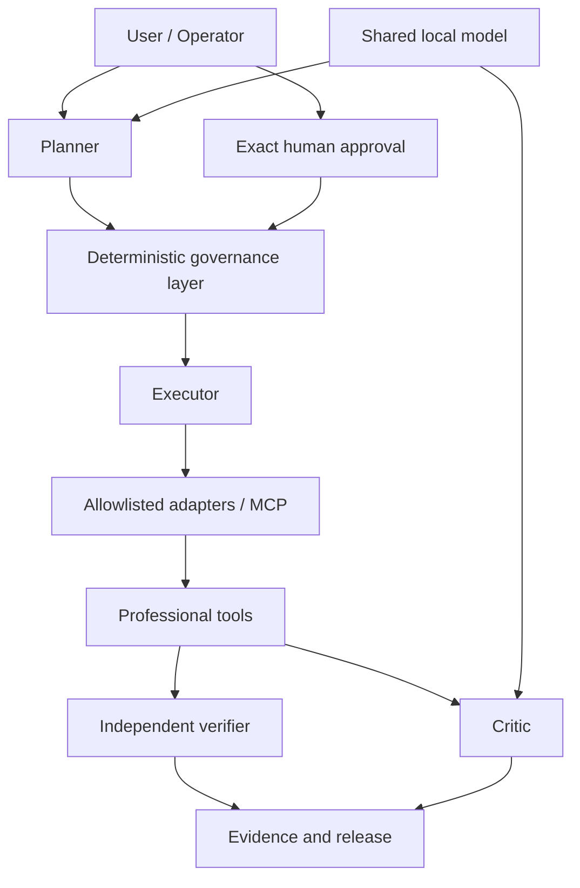
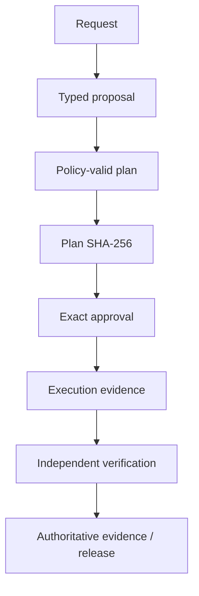

# Architecture

## Core principle

> Models propose; deterministic software authorizes, executes, validates, and
> records evidence.

Generated text is untrusted input. It cannot grant permissions, approve a
mutation, select arbitrary executable entrypoints, or declare its own work
successful.

## Core components

- **Model:** one shared local Ollama/Qwen endpoint. Model connectivity does not
  imply tool authority.
- **Planner Agent:** receives a bounded context pack and creates a structured,
  non-executing proposal.
- **Executor Agent:** accepts only an exact authorized artifact and dispatches
  fixed approval-gated operations.
- **Critic Agent:** reads bounded deterministic evidence, identifies unresolved
  risks, and produces a schema-constrained assessment without changing status.
- **Builder Agent:** proposes bounded extension candidates that remain
  untrusted until isolated tests, review, promotion, activation, and
  post-activation verification succeed.
- **Human Operator:** approves or denies an exact digest and consequential step
  scope. A changed artifact requires a new decision.
- **Harness:** owns schemas, policy, state, digests, approvals, redaction,
  timeouts, failures, traces, and artifact rules.
- **GIS/MCP boundary:** owns professional-tool dependencies and credentials and
  exposes only typed, allowlisted operations.
- **Verifier:** independently reloads authoritative artifacts and inspects
  resulting state. It is deterministic software, not an LLM agent.
- **Evidence and release:** preserve digest-addressed execution, verification,
  history, and release artifacts.

## Authority structure



The Planner and Critic use distinct manifests, contexts, and permissions even
when they share a model runtime. The Executor has no model access. Tool and
database credentials remain inside the professional-tool boundary.

## Governed artifact chain



Each downstream artifact identifies the exact upstream artifacts it depends
on. Digests are recomputed at trust boundaries. Missing, changed, expired, or
inconsistently scoped evidence fails closed.

## Runtime topology

- Planner and Critic can reach only the shared model network required by their
  roles.
- Executor can reach only the fixed internal MCP control boundary.
- GIS/MCP owns controlled data mounts, GIS dependencies, and approved PostGIS
  connectivity.
- Planner, Executor, and Critic do not receive PostGIS credentials.
- Trusted plans, recipes, approvals, contexts, and registries are read-only at
  execution boundaries.
- Runtime artifacts can be written only beneath their dedicated bounded roots.

See [runtime boundaries](RUNTIME_BOUNDARIES.md) for the mount and access matrix.

## PostGIS reference lifecycle

Checkpoints 15A–15K demonstrate the complete governed lifecycle for a
consequential mutation:

```text
bounded inspection
-> deterministic comparison
-> deterministic change assessment
-> digest-bound promotion plan
-> exact promotion approval
-> serializable promotion execution
-> independent promotion verification
-> digest-bound rollback plan
-> separate rollback approval
-> serializable rollback execution
-> independent rollback verification
```

Inspection, comparison, and assessment accept no arbitrary SQL. Promotion and
rollback execute only fixed identifier-safe mutations. Both verifiers reload
and rehash the artifact chain and inspect PostGIS through separate read-only
transactions rather than trusting executor claims.

## Generated-extension lifecycle

The Builder cannot promote its own output. Generated candidates pass through:

```text
bounded request
-> candidate generation
-> path and content inspection
-> isolated materialization
-> network-disabled tests
-> deterministic review
-> exact human approval
-> transactional promotion
-> activation
-> post-activation verification
```

This preserves the same separation between intelligence and authority when the
system proposes extensions to itself.
